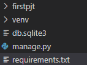
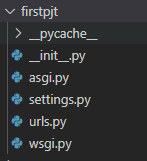
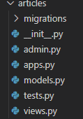

```python
1. 가상환경 설정

    python -m venv venv

2. 가상환경 활성화

    source ./venv/Scripts/activate

3. 장고 버전 설치

    pip install django==3.2.13

4. 패키지 목록 생성

    pip freeze > requirements.txt

5. 패키지 목록의 패키지 설치

    pip install -r requirements.txt

6. 프로젝트 생성

    django-admin startproject (프로젝트명) (프로젝트생성위치)

    뒤에 .을 붙이면 내 폴더가 프로젝트가 되는거임
```
**LTS - long team support (장기 지원 버전)**

몇년간은 주기적으로 업데이트를 해줌
```python
7. 서버 실행

    python manage.py runserver
```
---
폴더 구조


manage.py - 장고를 컨트롤 하는 파일
db.sqlite3 - DB파일
requirements.txt - 패키지 목록

---

init - 패키지로 인식하게 만드는 파일

urls.py - 클라이언트가 요청한 주소를 분기해서 서버에 전달 (우편배달부)

settings.py - 장고 프로젝트 전반에 대한 세팅

asgi.py wsgi.py - 동기적실행 비동기적 실행(배포단계)
---
```python
8. django 어플리케이션 생성

    하나의 프로젝트에 여러가지 앱이 들어갈 수 있음!

    앱을 나누는 단위는 **기능**

    python manage.py startapp (앱이름)

    보통 앱 이름은 복수형으로 씀


9. 앱 추가후 settings.py에 등록하기
    settings.py

    INSTALLED_APPS = [
        'articles', # 방금 만든 앱을 추가
        'django.contrib.admin',
        'django.contrib.auth',
        'django.contrib.contenttypes',
        'django.contrib.sessions',
        'django.contrib.messages',
        'django.contrib.staticfiles',
    ]

```
---


migrations - DB 변경 히스토리 (.git같은거임)

init.py - 패키지로 인식하게 만드는 파일

admin.py - 관리자용 페이지를 조작할 때 쓰는 파일

apps.py - 앱의 정보가 작성된 곳. 추가코드를 작성하진 않음

models.py - MTV의 M. DB를 조작할 때 쓰는 파일

tests.py - 프로젝트의 테스트 코드 작성

views.py - MTV의 V. model를 template으로 연결

---
__project 와 앱__

```
프로젝트 - 앱의 집합, 여러앱 가능

앱에는 여러 프로젝트에 있을 수 있음
```
```
앱 - 실제 요청을 처리하고 페이지를 보여주는 등의 역할

앱은 보통 하나의 역할 및 기능 단위로 작성 권장

settins.py의 INSTALLED_APPS 리스트는 리스트이기 때문에 순서가 반영됨 → 위쪽에 만든 앱을 추가
```
---

### 장고의 코드 작성 순서

URL → VIEW → TEMPLATE

---