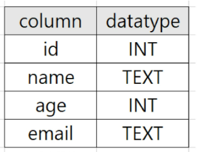

# DJANGO 2

## Django Model

## Database

체계화된 데이터의 모임

검색 및 구조화 같은 작업을 보다 쉽게 하기 위해 조직화된 데이터를 수집하는 저장 시스템

기본구조

1. 스키마(Schema)
    
    데이터베이스의 Structure (뼈대)
    
    데이터베이스에서 자료의 구조, 표현방법, 관계 등을 정의한 구조
    
    **테이블에 대한 전체적인 정보**
    
    
    
    id는 INT타입인 것 등을 알 수 있다
    
2. 테이블(Table)
    
    **스키마를 기반으로한 데이터가 들어간 집합**
    
    데이터 요소들의 집합
    
    관계라고도 부름
    
    필드 → 속성, 열(column) ⇒ 고유한 데이터 형식이 지정됨
    
    레코드 → 튜플, 행(row) ⇒ 테이블의 데이터는 레코드에 저장됨
    
    **데이터를 추가한다 = 레코드를 추가한다**
    
    
    
    엑셀로 보면 엑셀 하나가 DB라고 생각하면 됨
    

### PK (Primary Key)

기본 키

각 레코드의 고유한 값 (식별자로 사용)

다른 항목과 절대로 중복되어 나타날 수 없는 단일 값(unique)를 가짐 → id column

PK == 주민등록번호

### Query (쿼리)

데이터를 조회하기 위한 명령어

Query를 날린다 → DB를 조작한다

## Model

django의 DB에 접근하기 위한 창구

단일한 데이터에 대한 정보를 가짐

사용자가 저장하는 데이터들의 필수적인 필드들과 동작들을 포함

저장된 데이터베이스의 구조 (layout)

모델 클래스 1개 == DB 테이블 1개

매핑 = 하나의 값을 다른 값으로 대응

```python
# models.py

# Article이라는 데이터구조의 스키마를 정의
class Aritcle(models.Model):    # 모듈의 Model class 상속
	title = models.CharField(max_length=10)   # CharField 클래스의 변수는 하나의 DB필드이름
	content = models.TextFields()    # CharField는 길이가 제한이 있지만 Text는 없음
# 각 Field는 DB필드의 데이터 타입
# id column은 알아서 만들어짐
```

→ django model field라고 함

### CharField(max_length=None, **options)

길이의 제한이 있는 문자열

max_length ⇒ 필드의 최대 길이. DB와 Django의 유효성(값 검증) 검사에서 활용

### TextField(**options)

글자 수가 많을 때 사용. DB 서비스(MySQL, SQLite, Oracle 등)에 따른 글자 수 최대가 다름.

DB의 최대 글자 수에 따른 값까지만 가능

---

### DB Schema

| column | data type |
| --- | --- |
| title | VARCHAR(10) |
| content | TEXT |

클래스를 통해 DB는 만들었지만 모델에 생긴 데이터 변화를 반영할 순 없음.

이를 위한 것이 바로

## Migrations

python [manage.py](http://manage.py) makemigrations → 모델에 기반한 새로운 migration(설계도, 청사진)을 만들 때 사용.

이하 0001_initial.py 파일은 자동으로 만들어짐

```python
from django.db import migrations, models

class Migration(migrations.Migration):

    initial = True

    dependencies = [
    ]

    operations = [
        migrations.CreateModel(
            name='Article',
            fields=[
                ('id', models.BigAutoField(auto_created=True, primary_key=True, serialize=False, verbose_name='ID')),
                ('title', models.CharField(max_length=10)),
                ('content', models.TextField()),
            ],
        ),
    ]
```

Article class를 만들면서 models.Model을 상속하며 Field클래스를 통해 클래스 변수를 만든 것은

makemigrations를 통해 지을 migration(설계도)의 설계도임

아직 근데 DB는 비어있음..

### migrate

모델의 변경사항과 DB를 동기화

python [manage.py](http://manage.py) migrate


artices_article ⇒ 스키마 정보

python [manage.py](http://manage.py) showmigrations

migration 확인

⭐python [manage.py](http://manage.py) makemigrations → python manage.py migrate

---

### 추가필드정의

models.py에 변경사항이 생겼을 때 migration에 추가하기

기존 테이블에 column을 추가하기 → DB는 기본적으로 빈 값을 넣을 수 없음

```python
from django.db import models

# Create your models here.
class Article(models.Model):
    title = models.CharField(max_length=10)
    content = models.TextField()
    created_at = models.DateTimeField(auto_now_add=True)   # 추가
    updated_at = models.DateTimeField(auto_now=True)       # 추가

# python manage.py makemigrations

You are trying to add the field 'created_at' with 'auto_now_add=True' to article without a default; the database needs something to populate existing rows.

 1) Provide a one-off default now (will be set on all existing rows)
 2) Quit, and let me add a default in models.py
Select an option:

# 빈 값인 column을 추가하려고 했기 때문에 기본값을 지금 입력하거나(1번옵션)
# models.py에 다시 값을 추가하라는 것(2번옵션)

# 이미 DateTimeField에서는 지금 시간을 가져오기 때문에 그냥 엔터만 누르면
# 지금 시간을 값으로 입력해주겠다
Please enter the default value now, as valid Python
You can accept the default 'timezone.now' by pressing 'Enter' or you can provide another value.
The datetime and django.utils.timezone modules are available, so you can do e.g. timezone.now
Type 'exit' to exit this prompt
[default: timezone.now] >>>
Migrations for 'articles':
  articles\migrations\0002_auto_20220831_1504.py
    - Add field created_at to article
    - Add field updated_at to article
```

```python
# 0002_auto_**.py

from django.db import migrations, models
import django.utils.timezone

class Migration(migrations.Migration):

    dependencies = [
        ('articles', '0001_initial'),
    ]

    operations = [
        migrations.AddField(
            model_name='article',
            name='created_at',
            field=models.DateTimeField(auto_now_add=True, default=django.utils.timezone.now),
            preserve_default=False,
        ),
        migrations.AddField(
            model_name='article',
            name='updated_at',
            field=models.DateTimeField(auto_now=True),
        ),
    ]

# 2번설계도는 1번 설계도에서 추가된 것이기 때문에 1번에 의존성이 있음
# dependencies = [] 리스트 안에 1번 설계도(migrations)가 있음

# 하지만 models.py에서 새로운 Model클래스를 선언하면서 데이터를 추가하면 의존성이 생기진 않음

# git과 마찬가지로 설계도의 기록을 기록해두고
# 새로 추가한 데이터로 인해 오류가 생기면 이전 버전으로 돌리기 위함

# makemigration 했으면 python manage.py migrate

$ python manage.py migrate
Operations to perform:
  Apply all migrations: admin, articles, auth, contenttypes, sessions
Running migrations:
  Applying articles.0002_auto_20220831_1504... OK
(venv)
```

### ⭐DateTimeField()

python의 datetime.datetime 클래스의 인스턴스로 표시되는 날짜 및 시간을 값으로 사용하는 필드

DataField의 상속을 받는 클래스

선택인자

1. auto_now_add ⇒ 최초 **생성** 일자 : 데이터가 실제로 **만들어질** 때 현재 날짜+시간을 자동으로 초기화
2. auto_now ⇒ 최종 **수정** 일자 : 데이터가 **수정**될 때마다 현재 날짜와 시간이 자동으로 갱신

---

## migration 3단계

1. [models.py](http://models.py) 변경
2. migration 생성 → python [manage.py](http://manage.py) makemigrations
3. DB반영 → python [manage.py](http://manage.py) migrate

근데 makemigrations는 파이썬으로 이뤄져 있다. 하지만 DB와는 언어가 다름!

그럼 설계도는 누가 해석할까?? → **ORM**

## ORM

Object - Relational - Mapping 객체 지향 매핑

django와 DB간의 데이터 변환 프로그래밍 기술

django는 내장 ORM이 있음 == SQL을 사용하지 않고 DB를 활용할 수 있다

장고에서 파이썬 언어로 ORM에 보내면 SQL 언어로 변환해줌

반대도 마찬가지

장점

1. SQL 언어를 몰라도 DB조작가능
2. 객체 지향적 접근으로 인한 높은 **생산성**

단점

1. ORM만으로는 세밀한 DB조작을 할 수 없음..

**model → 웹 앱의 데이터를 구조화하고 조작하기 위한 도구**

### ipython, django-extensions 설치

```python
INSTALLED_APPS = [
    'articles',
    'django_extensions',    # 여기임
    'django.contrib.admin',
    'django.contrib.auth',
    'django.contrib.contenttypes',
    'django.contrib.sessions',
    'django.contrib.messages',
    'django.contrib.staticfiles',
]
```

django-shell 실행

python [manage.py](http://manage.py) shell_plus

```python
$ python manage.py shell_plus
# Shell Plus Model Imports
from articles.models import Article     # 우리가 만든 앱
from django.contrib.admin.models import LogEntry
from django.contrib.auth.models import Group, Permission, User
from django.contrib.contenttypes.models import ContentType
from django.contrib.sessions.models import Session
# Shell Plus Django Imports
from django.core.cache import cache
from django.conf import settings
from django.contrib.auth import get_user_model
from django.db import transaction
from django.db.models import Avg, Case, Count, F, Max, Min, Prefetch, Q, Sum, When
from django.utils import timezone
from django.urls import reverse
from django.db.models import Exists, OuterRef, Subquery
Python 3.10.4 (tags/v3.10.4:9d38120, Mar 23 2022, 23:13:41) [MSC v.1929 64 bit (AMD64)]
Type 'copyright', 'credits' or 'license' for more information
IPython 8.4.0 -- An enhanced Interactive Python. Type '?' for help.
```

% 종료는 exit()

## QuerySet API

DB API

django가 제공하는 ORM을 통한 DB조작방법

Article.objects.all() == Model class.Manager.**Queryset API**

### objects manager

django는 모델 클래스에 대해 objects라는 manager 객체를 자동으로 추가

→ 얘를 통해 메서드를 써서 특정 데이터 조작

### Query

DB에 특정 데이터를 달라는 요청 = 쿼리문

쿼리문을 작성한다 = 원하는 데이터를 얻기 위해 DB에 요청을 보낼 코드를 작성

ORM은 DB로부터 오는 응답 데이터를 QuerySet이라는 자료형으로 바꿔서 보내줌

### QuerySet

DB에게서 전달 받은 객체 목록(데이터 모음) → 순회 가능한 데이터 (필터, 정렬 가능)

**데이터 객체 하나만 오면 인스턴스로 옴**

→ get을 통한 접근

### CRUD

컴퓨터 SW가 가지는 기본 데이터 처리 기능

Create Read Update Delete - 생성 조회 수정 삭제

### 데이터 객체 생성 방법

1. article = Article()
    
    → 클래스를 통한 인스턴스 생성
    
2. article.title
    
    → 클래스 변수명과 같은 이름의 인스턴스 변수를 생성 후 값 할당
    
3. article.save()
    
    → 인스턴스로 save 메서드 호출
    

```python
In [1]: Article.objects.all()
Out[1]: <QuerySet []>

In [2]: article = Article()

In [3]: article
Out[3]: <Article: Article object (None)>

In [4]: article.title = 'first'

In [5]: article.content = 'django!'

In [6]: article.save()

In [7]: article
Out[7]: <Article: Article object (1)> # 1은 id
```


아니면 한번에 값을 생성해버리기

```python
In [8]: article
Out[8]: <Article: Article object (1)>

In [9]: article = Article(title='second',content='django!')

In [10]: article.save()

In [11]: article
Out[11]: <Article: Article object (2)>
```


값들 보기

```python
In [13]: article.title
Out[13]: 'second'

In [14]: article.content
Out[14]: 'django!'

In [15]: article.id
Out[15]: 2

In [16]: article.pk
Out[16]: 2
```

3번째 방법

```python
In [17]: Article.objects.create(title='third', content='django!')
Out[17]: <Article: Article object (3)>

# 만들면서 저장까지
```


article같은 인스턴스 이름은 중요하지 않음!! ssafy = Article()로 해도 결국에는 Article() DB에 저장댐

### .save()

객체를 DB에 저장하는 것

save를 하지 않으면 ORM에만 머물고 있는 것이고 save를 호출해야 DB 테이블에 레코드가 생성됨

### READ - 조회

QuerySet API method를 사용

querysets ⇒ 객체 목록을 받는가 get

non querysets ⇒ 데이터 하나만을 받는가 filter, all

```python
In [22]: articles = Article.objects.all()

In [23]: articles
Out[23]: <QuerySet [<Article: Article object (1)>, <Article: Article object (2)>, <Article: Article object (3)>]>

In [24]: for i in articles:
    ...:     print(i)
    ...: 
Article object (1)
Article object (2)
Article object (3)
```

### get()

단일 데이터 조회 ⇒ 객체를 못찾으면 DoesNotExist, 둘 이상의 객체를 찾으면 MultipleObjectsReturned

PK같이 고유성을 보장하는 조회에서 사용

```python
In [25]: Article.objects.get(id=1)
Out[25]: <Article: Article object (1)>

In [26]: Article.objects.get(pk=1)
Out[26]: <Article: Article object (1)>

# 단일 객체로 전달받았음

In [27]: Article.objects.get(pk=100)
---------------------------------------------------------------------------
DoesNotExist                              Traceback (most recent call last)

In [28]: Article.objects.get(content='django!')
---------------------------------------------------------------------------
MultipleObjectsReturned                   Traceback (most recent call last)
```

### filter()

```python
In [29]: Article.objects.filter(content='django!')
Out[29]: <QuerySet [<Article: Article object (1)>, <Article: Article object (2)>, <Article: Article object (3)>]>
```

if문 생각하면 됨

일차하는 데이터가 없으면 빈 queryset, 1개만 찾아도 queryset

⭐id는 filter로 찾으면 안되는 이유

1. 없어도 빈 queryset을 리턴
2. 찾아도 queryset형태로 주기에 한번 더 리스트 안을 들여다봐야함

### field lookups

특정 레코드에 대한 조건을 설정

```python
In [30]: Article.objects.filter(content__contains='ja')
Out[30]: <QuerySet [<Article: Article object (1)>, <Article: Article object (2)>, <Article: Article object (3)>]>
```

## UPDATE

조회 후 반환 값을 저장 후 인스턴스 수정 후 저장

```python
In [31]: article = Article.objects.get(pk=1)  # 조회

In [32]: article.title
Out[32]: 'first'

In [33]: article.title = 'byebye'   # 인스턴스 수정

In [34]: article.save()             # 인스턴스 DB에 저장

In [35]: article.title
Out[35]: 'byebye'
```

### DELETE

조회 후 반환 값 저장 후 삭제

```python
In [36]: article = Article.objects.get(pk=1)

In [37]: article
Out[37]: <Article: Article object (1)>

In [38]: article.delete()
Out[38]: (1, {'articles.Article': 1})

In [39]: Article.objects.get(pk=1)
---------------------------------------------------------------------------
DoesNotExist                              Traceback (most recent call last)
```


여기서 데이터 추가하면 id=4번임

왜 와이 → 삭제된 데이터는 취급하지않음

- 참고
    
    던더 str()
    
    출력을 변화해 줄 수 있음
    
    ```python
    # models.py
    
    class Article(models.Model):
        title = models.CharField(max_length=10)
        content = models.TextField()
        created_at = models.DateTimeField(auto_now_add=True)
        updated_at = models.DateTimeField(auto_now=True)
    
        def __str__(self):
            return self.title
    
    In [41]: Article.objects.filter(content='django!')
    Out[41]: <QuerySet [<Article: Article object (2)>, <Article: Article object (3)>]>
    
    In [1]: Article.objects.filter(content='django!')
    Out[1]: <QuerySet [<Article: second>, <Article: third>]>
    
    # 장고 쉘 껏다 켜야지 출력형식이 변경된
    # makemigrations를 해줄 필요는 없음 -> 왜 와이, DB자체에 변경사항이 없음..
    ```
    
    ## CRUD
    
    ### READ 1
    
    ```python
    # urls.py
    
    from articles import views
    from django.urls import path
    
    urlpatterns = [
        path('', views.index),
    ]
    
    # views.py
    from django.shortcuts import render
    from .models import Article
    
    # Create your views here.
    
    def index(request):
        # DB에 전체 데이터를 조회
        articles = Article.objects.all()
        context = {
            'articles' : articles,
        }
        return render(request, 'articles/index.html', context)
    
    # index.html
    
    
    
      <h1>Articles</h1>
      <hr>
      
      <p>글 번호 : {{ article.pk }}</p>
      <p>제목 : {{ article.title }}</p>
      <p>내용 : {{ article.content }}</p>
      <hr>
      
     
    ```
    
    ### CREATE
    
    ```python
    # urls.py
    from articles import views
    from django.urls import path
    
    app_name = 'articles'
    urlpatterns = [
        path('', views.index, name='index'),
        path('new/', views.new, name='new'),
        path('create/', views.create, name='create'),
    ]
    
    # views.py
    def new(request):
        return render(request, 'articles/new.html')
    
    def create(request):
        title = request.GET.get('title')
        content = request.GET.get('content')
    
        # article = Article()
        # article.title = title
        # article.content = content
        # article.save()
        
        article = Article(title=title, content=content)
        article.save()
    
        # Article.objects.create(title=title, content=content)
    
        return render(request, 'articles/create.html')
    
    # new.html
    
    
    
      <h1>NEW</h1>
      <form action="" method="GET">
        <label for="title">Title: </label>
        <input type="text" name="title" id="title">
        <br>
        <label for="content">Contetnt: </label>
        <input type="text" name="content" id="content">
        <br>
        <input type="submit">
      </form>
      <hr>
      <a href="">뒤로가기</a>
    
    
    # create.html
    
    
    
      <h1>Create!!</h1> 
      <a href="">뒤로가기</a>
    
    ```
    
    new에 접속해서 form을 통해 제출하면 GET 방식으로 create url로 데이터가 query string 형태에 담겨서 create/?title=입력값&content=입력값
    
    형태로 접속되며
    
    request.GET.get(’title’) 형태로 값을 받아서
    
    article = Article(title = title, content = content) 로 인스턴스에 저장하고
    
    article.save() DB에 저장하고
    
    create.html 파일을 출력한다
    
    ### Django redirect
    

    [render 공식문서](https://docs.djangoproject.com/en/4.1/topics/http/shortcuts/#render)
    <br>
    
    redirect는 
    
    views에 쓰이는 메서드로써 url을 반환한다
    
    ### CREATE
    
    HttpResponse status code
    
    요청이 성공적으로 완료 되었는지 여부
    
    1xx → 정보적인 응답
    
    2xx → 성공
    
    3xx → redirect 메시지
    
    4xx → 클라이언트 에러
    
    5xx → 서버 에러
    
    ### FORM 제출을 POST형식으로
    
    데이터를 가져올 때는 GET, 데이터를 수정할 때는 POST로 해야지 취업이 된다………..
    
    ```python
    
    
      <h1>작성하기</h1>
      <form action="" method="POST">
        <label for="title">제목</label>
        <input type="text" name="title" id="title"><br>
        <label for="content">내용</label>
        <input type="text" name="content" id="content"><br>
        <input type="submit" value="제출">
      </form>
    
    
    def create(request):
        title = request.POST.get('title')
        content = request.POST.get('content')
    
        article = Article(title=title, content=content)
        article.save()
        return redirect('articles:index')
    ```
    
    이러면 403 forbidden error가 뜸 → DB에는 아무나 접근 못하는데 클라이언트는 권한이 없다는 것
    
    그래서
    
    ```python
    
    
      <h1>작성하기</h1>
      <form action="" method="POST">
        
        <label for="title">제목</label>
        <input type="text" name="title" id="title"><br>
        <label for="content">내용</label>
        <input type="text" name="content" id="content"><br>
        <input type="submit" value="제출">
      </form>
    
    ```
    
    csrf_token으로 권한을 줘야함
    
    ### detail
    
    ```python
    # urls.py
    from django.urls import path
    from articles import views
    
    app_name = 'articles'
    urlpatterns = [
        path('', views.index, name='index'),
        path('index/', views.main),
        path('new/', views.new, name='new'),
        path('create/', views.create, name='create'),
        path('<int:pk>/', views.detail, name='detail'),
    ]
    
    # views.py
    def detail(request, pk):
        article = Article.objects.get(pk=pk)
        context = {'article':article}
        return render(request, 'articles/detail.html', context)
    
    # detail.html
    
    
    
      <h1>Index of articles</h1>
      <a href="">글쓰기</a>
      <hr>
      
        <h3>글 번호: {{article.pk}}</h3>
        <h3><a href="">제목: {{article.title}}</a></h3>
        <h3>내용: {{article.content}}</h3>
        <hr>
      
    
    ```
    
    variable 라우팅 주소로 넘기기
    
    ```jsx
    
    
      <h1>Index of articles</h1>
      <a href="">글쓰기</a>
      <hr>
      
        <h3>글 번호: {{article.pk}}</h3>
        <h3><a href="">제목: {{article.title}}</a></h3>
        <h3>내용: {{article.content}}</h3>
        <hr>
      
    
    ```
    
    url ‘앱이름:path name’ 라우팅
    
    편집기능
    
    ```python
    # urls.py
    
    from django.urls import path
    from articles import views
    
    app_name = 'articles'
    urlpatterns = [
        path('', views.index, name='index'),
        path('index/', views.main),
        path('new/', views.new, name='new'),
        path('create/', views.create, name='create'),
        path('<int:pk>/', views.detail, name='detail'),
        path('<int:pk>/delete/', views.delete, name='delete'),
        path('<int:pk>/edit/', views.edit, name='edit'),
        path('<int:pk>/update/', views.update, name='update'),
    ]
    
    # views.py
    def edit(request, pk):
        article = Article.objects.get(pk=pk)
        context = {
            'article' : article,
        }
    
        return render(request, 'articles/edit.html', context)
    
    def update(request, pk):
        article = Article.objects.get(pk=pk)
        title = request.POST.get('title')
        content = request.POST.get('content')
        article.title = title
        article.content = content
        article.save()
    
        return redirect('articles:detail', article.pk)
    
    # detail.html
    
    
      <h1>글 상세</h1>
      <hr>
      <h3>{{article.pk}}번째 글</h3>
      <h1>제목: {{article.title}}</h1>
      <hr>
      <p>내용</p>
      <p>{{article.content}}</p>
      <hr>
      <p>작성시각: {{article.created_at}}</p>
      <p>수정시각: {{article.updated_at}}</p>
      <hr>
    
      <form action="" method="POST">
        
        <input type="submit" value="글 삭제">
      </form>
      <br>
      <p><a href="">글 목록</a></p>
      <p><a href="">글 수정</a></p>
    
    
    # edit.html
    
    
      <h1>글 수정</h1>
      <form action="" method="POST">
        
        <label for="title">제목</label>
        <input type="text" name="title" id="title" value={{article.title}}><br>
        <label for="content">내용</label>
        <input type="text" name="content" id="content" value={{article.content}}><br>
        <input type="submit" value="수정완료">
      </form>
    
      <a href="">글로</a>
    
    ```
    
    ### 관리자 사이트
    
    django의 기능인 관리자 페이지
    
    python [manage.py](http://manage.py/) createsuperuser 를 통해
    
    username, email, password를 입력하고
    
    url/admin을 통해 관리자 페이지에 접근 가능!
    
    그 전에
    
    ```python
    from django.contrib import admin
    from articles.models import Article
    
    admin.site.register(Article)
    ```
    
    app/admin.py에서 앱을 등록해줘야한다
    
    ### ⭐총정리
    
    1. Model
        - django는 model을 통해 데이터에 접속하고 관리
    2. ORM
        - 객체지향 프로그래밍을 이용한 DB 조작
    3. Migrations
        - 모델에 생긴 변화를 DB에 반영하는 방법
    4. HTTP request & response
        - 요청에 행동을 표현하는 HTTP request method (GET, POST)
        - 요청에 대한 성공 여부 응답을 숫자로 표현하는 HTTP response status codes(1xx ~ 5xx)