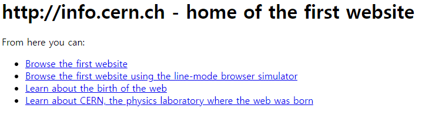

# DJANGO 1

웹 서비스 개발 - 로그인/아웃, 회원관리, DB, 서버, 클라이언트, 보안 등

## 인터넷

www(월드 와이드 웹) : 전세계에 퍼져 있는 거미줄 같은 연결망

# 인터넷과 웹

인터넷과 웹은 다르다

인터넷이 도시라면 웹은 그 건물 중 하나

인터넷 > 웹,이메일,FTP



첫 웹사이트(원시 웹)

### 클라이언트와 서버


### 웹 페이지

웹에 있는 문서. 화면 한 장 한 장이 웹 페이지임

정적, 동적 웹페이지

### Traling slash

주소 끝에 / ←를 쓰는 이유 (traling slash)

예전 인터넷에서는 /를 붙이면 디렉토리, 안붙이면 파일을 뜻햇음

장고는 traling slash는 디폴트가 True임

내가 만든 웹사이트에서 하나라도 붙이면 다 붙여야함

**a태그를 사용할 때 “/index/”에서 앞에 /는 home url에서 이동하는 거고**

**없으면 내가 있는 위치에서 이동하는거임**

[https://hphk.notion.site/django-d740640e4fb6472da39c1ba948b004b4#52e367cfc1f945409155ead2172e99b1](https://www.notion.so/django-d740640e4fb6472da39c1ba948b004b4)

### 클라이언트와 서버간의 통신

⭐FORM 태그

form의 action(어디로) method(어떤 방식)이 중요함

### action, method

form에 담긴 데이터를 어디로 보낼지 → URL

어떻게 보낼지(post,get) → method

- get - url에 데이터를 담아 보냄
- post - 숨겨서 보냄

form과 input, label 태그는 그냥 햄버거와 패티임

input의 **name** 속성은 서버에서 form으로부터 오는 데이터를 식별하기 위한 속성임

```html
<h1>던지기</h1>
<form action="/catch/", method="GET">
  <label for="message"></label>
  <input type="text" id="message" name="message">
  <input type="submit">
</form>
```


[http://127.0.0.1:8000/throw/](http://127.0.0.1:8000/throw/)

[http://127.0.0.1:8000/catch/?message=test](http://127.0.0.1:8000/catch/?message=%ED%95%98%EC%9D%B4)

query string은 ?message=test

?key=value&key2=value2

method의 defalut는 get

**form**을 통해 제출한 **데이터**를 **url**에 **query string 형태**로 데이터를 담아 **action의 링크**로 보낸다

```python
def catch(request):
    data = request.GET.get('message')
    context = {'data':data}
    return render(request, 'catch.html', context)
```

request.GET.get('message')

request 요청한 데이터 중

GET GET방식으로

get 가져온다

message라는 name 속성을 가진 데이터를

### HTTP

HTML 문서와 같은 리소스들을 가져올 수 있또록 해주는 프로토콜

### variable routing

url을 기반으로 분기하고 싶을 때

url의 어떤 부분을 변수처리하고 이에 따라 웹 페이지를 표현하고 싶을 때

```python
# urls.py

urlpatterns = [
	path('hello/<name>/', views.hello),
]
# 디폴트는 <str:>임

# views.py
def hello(request, name):
	context = {'name':name}
	return render(request, 'hello.html', context)
```

### url 매핑

만약 path에서 index/가 이미 있고 이 상태에서 다른 앱의 pages-index/를 path로 통해 접근하면 처음의 index/가 실행됨

그래서 include를 통해 분기를 나누고

앱 내의 urls.py를 통해 분기처리

그리고 html파일들을 templates 안에 앱이름으로 된 디렉토리를 생성하고 파일을 여기에 둬서 구분

```python
# 프로젝트 urls.py
from django.contrib import admin
from django.urls import path, include

urlpatterns = [
    path('admin/', admin.site.urls),
    path('articles/', include('articles.urls')),
    path('pages/', include('pages.urls')),
]

# 앱 articles urls.py

from django.urls import path
from articles import views

app_name = "articles"
urlpatterns = [
    path('articles/index/', views.index, name="index"),
]

# 앱 pages.py

from django.urls import path
from pages import views

app_name = "pages"
urlpatterns = [
    path('pages/index/', views.index, name="index"),
]

# app_name을 지정해주지 않으면 하단의 aritcles:를 쓰지 않아도 된다.

# 앱 articles index.html


  <h2>hola</h2>
  <h2>hola</h2>
  <h2>hola</h2>
  
  <div><a href="">greeting</a></div>
  <div><a href="">dinner</a></div>
  <div><a href="">throw</a></div>
  <div><a href="">fake-google</a></div>
  {# <div><a href="">hello</a></div> #}


# 앱 pages index.html


  <h1>pages의 index.html</h1> 

```

.