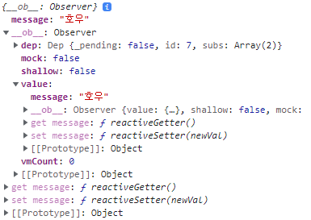

## Vuex

### State Management
상태 관리. 상태는 App이 가지고 있는 Data로 표현할 수 있다.
각 component는 독립적 -> 각각의 상태를 가진다. 이런 component가 모여서 같은 상태를 유지할 필요가 있다.

Pass Props, Emit Event를 통해서 상태 관리를 하게 되면
직관적이지만 <-> Component의 중첩이 깊어진다면 복잡한 구조가 된다.

depth가 많이 깊다면 쉽게 전달할 방법이 없을까? 그래서 나온 것이 Vuex

### Centralized Store
중앙 저장소에 데이터를 모아 상태 관리 << 각 Component는 중앙 저장소의 데이터를 사용
규모가 크거나 depth가 깊은 프로젝트의 데이터 관리가 쉬워진다

### Vuex
```js
// vuex/index.js
import Vue from 'vue'
import Vuex from 'vuex'

Vue.use(Vuex)

export default new Vuex.Store({
  state: {
  },
  getters: {
  },
  mutations: {
  },
  actions: {
  },
  modules: {
  }
})
```
1. State
  vue instance의 data -> 중앙 관리 **모든 상태 정보**가 있음
  **$store.state를 통해 state 데이터에 접근**

2. Mutations
  실제 **state 변경** 방법 (유일)
  Mutations에서 호출되는 핸들러 함수는 반드시 **동기적**이어야 함!!
  왜 와이 비동기 로직으로 mutations를 사용해서 state를 변경하는 경우 state 변화 시기를 특정할 수 없다
  첫 인자로 state를 받고 component나 Actions에서 commit() 메서드로 호출

3. Actions
  mutations과 비슷하지만 **비동기 작업 포함 가능**
  state를 직접 변경하지 않고 commit() 메서드로 **mutations**를 호출해서 state 변경
  context object를 인자로 받고 이를 통해 store.js의 모든 요소 & 메서드에 접근 가능 -> state 직접 변경은 가능, BUT 하면 안됨
  component에서 dispatch() 메서드에 의해 호출
  **state 변경 외의 모든 로직 수행**

? Mutations 와 Action
  component -> actions(BE API와 통신) -> mutations -> state 변경 -> component 변경
  **mutaions는 state만 바꾼다**

  state -> getters -> component

4. Getters
  vue 인스턴스의 computed에 해당
  state를 활용하여 **계산된 값**을 얻고자 할 때 사용
  결과는 캐시되며 종속된 값 변경시 재계산(computed 특징)
  getters 계산된 값은 state에 영향 x, state, getter이 argument


### state 가져오기
```js
// store/index.js
import Vue from 'vue'
import Vuex from 'vuex'

Vue.use(Vuex)

export default new Vuex.Store({
  state: {
    message: '하이'
  },
  getters: {
  },
  mutations: {
  },
  actions: {
  },
  modules: {
  }
})

// App.vue
<template>
  <div id="app">
    
    <h1>{{ message }}</h1>
  </div>
</template>

<script>

export default {
  name: 'App',
  components: {
  },
  computed: {
    message() {
      return this.$store.state.message
    }
  }
}
</script>
```

### actions
dispatch(A,B)
A -> 호출하고자 하는 actions 함수
B -> 넘겨줄 data

actions의 첫번째 인자는 context
-> context.state와 context.getters를 통해 mutations 호출 가능! 왜 와이 >> store의 전반적 속성을 모두 가짐

dispatch를 통해 다른 actions도 호출 가능하다
벗 BUT B.U.T. **actions에서 state를 직접 조작하는 것은 삼가야 함**

actions의 두 번째인자는 payload -> 넘겨준 데이터를 받아서 사용

context 내용


```js
// store/index.js
...
actions: {
  // component에서 호출될 actions 메서드
  changeMessage(context, message) {
    console.log(context)
    console.log(message)
  }
},
...

// App.vue
<template>
  ...
  <input type="text" @keyup.enter="changeMessge" v-model="inputData">
  ...
</template>

export default {
  ...
  data() {
    return {
      inputData: null,
    }
  },
  methods: {
    // actions 메서드 호출
    changeMessge() {
      const newMessage = this.inputData
      this.$store.dispatch('changeMessage', newMessage)
      this.inputData = null
    }
  }
}
```

### mutations
commit(A,B)
A- 호출하고자 하는 mutations 함수
B - 넘겨줄 데이터 = payload

```js
// store/index.js
  ...
  mutations: {
    // commit을 통해 호출된 state 변경하는 mutations method
    CHANGE_MESSAGE(state, message) {    // mutations의 method라고 알려주기 위해 대문자로
      // console.log(state)

      // state의 message 값을 인자로 넘어온 message로 바꿈
      state.message = message
    }
  },
  actions: {
    // component에서 호출될 actions 메서드
    changeMessage(context, message) {
      // console.log(context)
      // console.log(message)

      // mutations 호출
      context.commit('CHANGE_MESSAGE', message)
    }
  },
  ...
```

mutations의 함수 선언
```js
METHODNAME(state, value) {

}
```
state는

이렇게 생겼음

### getters
state를 활용한 새로운 변수
getters의 함수 선언
```js
METHODNAME(state) {
  return state.message.length
}
```

```js
// store/index.js
export default new Vuex.Store({
  ...
  getters: {
    messageLength(state) {
      return state.message.length
    }
  },
  ...
})

// App.vue
<template>
  ...
  <h3>{{ messageLength }}</h3>
  ...
</template>

export default {
  computed: {
    ...
    messageLength() {
      return this.$store.getters.messageLength
    }
  },
  ...
}
```

### Lifecycle Hooks
Vue 인스턴스의 생성과 소멸의 과정 중의 생명주기
Vue 인스턴스가 생성된 경우, 인스턴스를 DOM에 마운트하는 경우, 데이터 변경 후 DOM 업데이트하는 경우 등
각 단계가 트리거가 되어 특정 로직을 실행할 수 있음

1. created
  Vue instance 생성 후 호출
  data, computed 등 설정이 완료된 상태
  서버에서 받은 데이터를 vue instance의 data에 할당하는 로직에 적합
  단, BUT mount되지 않아서 요소에 접근할 순 없다.

2. mounted
  Vue instance가 요소에 mount된 후 호출 << mount된 요소를 조작할 수 있다

3. updated
  데이터가 변경되어 DOM에 변화를 줄 때 호출

4. 특징
  instance마다 각각의 Lifecycle을 가지고 있음
  부모 component가 mounted hook이 실행되었다고 해서 자식이 mount된 건 아니고
  부모 component가 updated hook이 실행되었다고 해서 자식 component가 updated 된 것이 아님

### Local Storage
브라우저의 Local Storage에 데이터를 저장하여 브라우저를 **종료**해도 데이터가 보존될 수 있도록 하는 것
```js
window.localStorage
```
데이터가 문자열 형태로 저장.
```js
window.localStorage.setItem(key, value) // key, value 형태로 저장
window.localStorage.getItem(key) // key에 해당하는 데이터 조회
```
set은 저장, get은 조회

**JSON.stringify**를 사용해 문자열로 변환하여 저장해야 한다!
state 변경이 아니기 떄문에 mutations에서 이뤄져야함.

### vuex-persistedstate
vuex state를 자동으로 Local Storage에 저장하고 불러와주는 라이브러리 중 하나

npm i vuex-persistedstate


### vuex는 언제 사용해야하는가
앱의 복잡성과 규모를 고려하여 선택해야함.
중 대형 규모의 SPA(Single Page Application)을 구축하는 경우에는 필요하게 된다 << 그냥 필요할 때 써라
